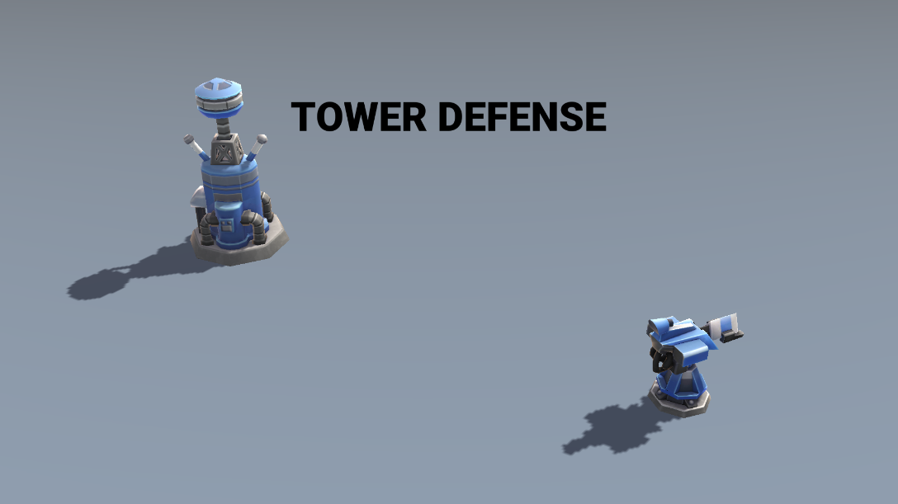
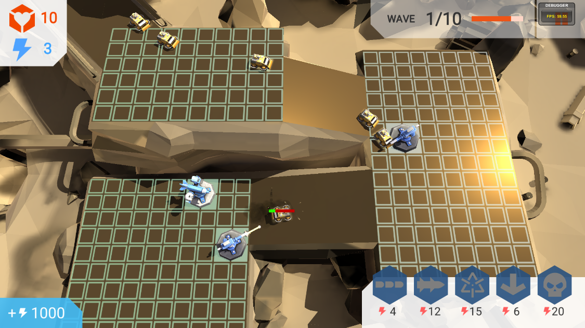

---

## 工程介绍   

此工程热更模块基于 HybridCLR + Addressable， 主要展示资源和代码热更的基础工程。 

（1）代码热更基于[HybridCLR跳转](https://github.com/focus-creative-games/HybridCLR)  
（2）资源热更基于[Addressable跳转](https://docs.unity3d.com/Packages/com.unity.addressables@1.21/manual/index.html)     
（3）资源管理基于[Asset Graph跳转](https://docs.unity3d.com/Packages/com.unity.assetgraph@1.7/manual/index.html)   

---

## 如何让项目运行并实现热更  

### HybridCLR编辑器操作
(1)点击执行HybridCLR/Installer打开一个窗体，点击Install等待安装完成  
(2)点击执行HybridCLR/Generate/All, 等待执行完毕    
(3)点击执行HybridCLR/Build/BuildAssetsAndCopyToRes,将Dll生成并拷贝到资源文件夹中   

### 资源管理操作
双击打开AssetGraph/AssetGraph.asset文件，执行右上角的Execute，自动将资源导入Addressables Groups中   
注意：生资源，成品资源路径区分  

### 游戏入口流程
(1)在Main场景下，对资源进行预下载，关闭了Addressable的自动加载（方便添加白名单测试）    
(2)加载完资源会调用初始化LoadDll,加载热更DLL   
(3)加载完DLL切换热更场景，进入热更模块   

### Addressable 实现本地模拟
需要利用Addressables Hosting搭建一个本地服务器，确保手机和电脑处于同一网络，便可实现热更

### 其他
(1)Unity 版本使用是2020.3.47f1  
(2)基于URP渲染管线  

---

## 项目包含一个完整的小游戏实例  

#### 游戏介绍  
基于GameFramework框架实现的塔防游戏，将资源模块改为Addressable，并接入HybridCLR代码热更。  

   
   
   

### 框架基于GameFramework  
使用框架的架构思想，并加以改进，如需扩展开发，只需要对GameFramework进行简单了解，可快速实现    

### 渲染基于URP  
基于URP渲染管线（开发中）  

### Jenkins自动打包流程  
只需在Jenkins配置，Choice Parameter，即可实现打包自动化（开发中）   
HotFixResources：热更资源；  ChannelPack：渠道包；  LocalPack：本地包；  FirstPack：首包；（渠道包和本地包基于首包的.bin输出）  

   
---

## FAQ

### 问题
(1)CDN服务器缓存问题，不能及时获取到hash, json（增加HTTP DNS，提高热更成功率）   
(2)Addressables版本问题，资源依赖问题，不能实现增量更新（升级版本后解决）    

